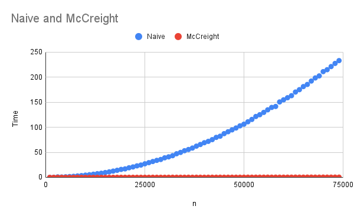
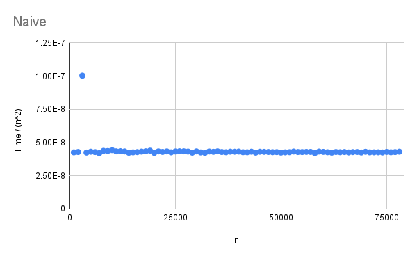
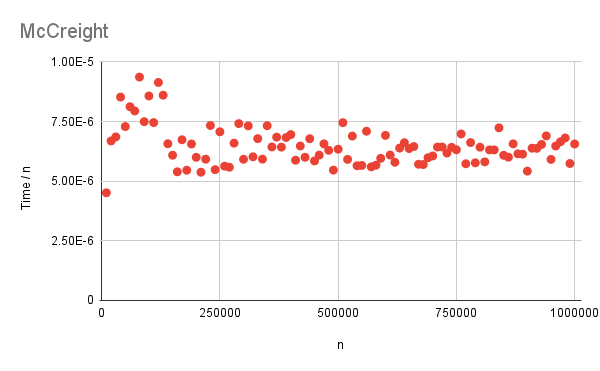
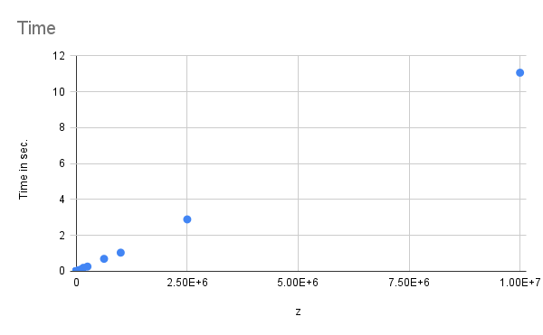
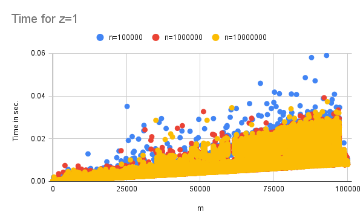

# Project 2: Suffix tree construction

You should implement a suffix tree construction algorithm. You can choose to implement the naive O(n²)-time construction algorithm as discussed in class or McCreight’s O(n) construction algorithm. After that, implement a search algorithm (similar to slow-scan) for finding all occurrences of a pattern. This algorithm should run in O(m+z) where m is the length of the pattern and z the number of occurrences.

Write a program, `st` using the suffix tree exact pattern search algorithm (similar to slow-scan) to report all indices in a string where a given pattern occurs. 

The program should take the same options as in project 1: `st genome.fa reads.fq`. The program should output (almost) the same SAM file. Because a search in a suffix tree is not done from the start to the end of the string the output might be in a different order, but if you sort the output from the previous project and for this program, they should be identical.

## Evaluation

Implement the tool `st` that does exact pattern matching using a suffix tree. Test it to the best of your abilities, and then fill out the report below.

# Report

## Implementation
We implemented both the naive quadratic time algorithm and McCreight’s linear time algorithm. 

## Insights
Indecies are again your enemy. 

Pretty printing is very much needed for nested classes like trees. 

Using the verbose argument is nice, since it makes it easy to switch between whether to print or not. 

Invariants of functions are important 

## Problems encountered if any.

For the naive, we had problems with splitting edges/nodes. This was solved by pen and paper, going sytematicly through cases, and using pretty printing. 

Initially we missed an edge case for McCreight’s algorithm, which resulted in it having the same worst-case running time as the naive. 

McCreight’s algorithm was difficult to get right, mostly since the indecies where difficult. 

The switch from a group of two to a group of one, changed the work process. 

## Correctness

### Building the tree
We started by using small examples, which could be done by hand and verified. 

We then used random examples and tested whether the output of the algorithms gave a 'valid' tree. A 'valid' tree might not be the correct one, but it contains all the expected leaves.

The resulting trees of the naive and McCreight’s algorithm were then compared for random exampels. They gave the same trees, just of different types, since one has suffix links.

### Search 

Likewise we first used some known examples for verifying the implementation of search. 

We then compared the results of the search algorithm on the naive and McCreight trees for random strings with the results from the kmp implementation from the last handin. 

### Conclusion of correctness

With these different methods of testing the contruction of trees and search, we are confident, the trees construction for the naive algorithm, McCreight’s algorithm, and search are correct. 

## Running time

For naive the worst case as a string of same chars, since the naive will go down the branches from the root. sum^n i = O(n²)

We can see on plots below, that the naive is O(n²) and McCreight is O(n) when running on strings of the same char. 

The timing of search is done on random strings x with random substrings of x as the pattern searched. 

The size of the output, z, is 1 for most of the test, so the results are split into those where z>1 and those where z=1.

From the plots and the logic of the implementation, the running time is probable to be something like O(m+z). O(m) to find the inner node which contains all the leaves and O(z) to output the leaves. O(z) is independent of the size of the tree, since the leaves can pay the whole subtree. 